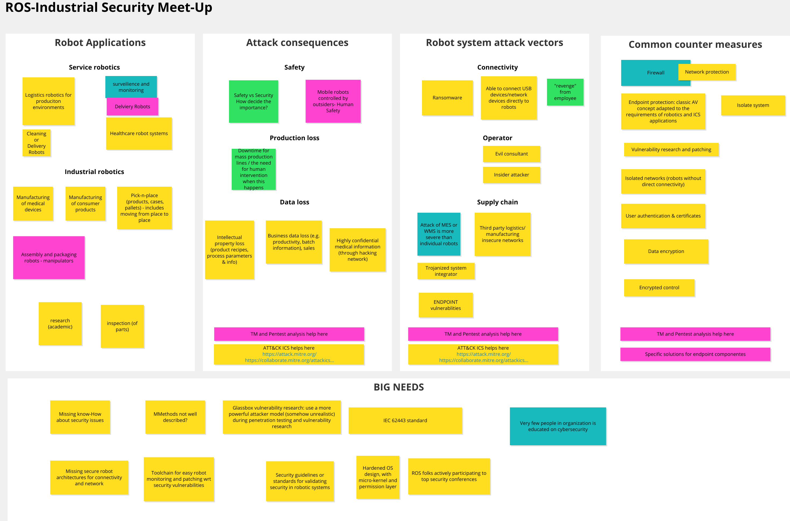

# ROS-Industrial Cyber-security Challenge Description

**Objective**:

In this document, we detail the challenges seen by the consortium members with regards to cyber-security in the robotics domain. The information presented in this document was gathered during an internal meet-up of ROS-Industrial Consortium partners on October 6, 2021. The goal of this document is to highlight problems industrial companies need to tackle when working with robots in modern working environments. 

**Target audience**:

This audience targets a number of stakeholders:

* **ROS2 developers:**  
  Perspective on what ROS2 is being used for in industry, which assets need to be protected, what attack vectors exist and counter measures exist
* **Technology developers:** 
  Insides which counter measures and methods are needed by industry
* **Industrial companies:**
  Overview of problems that need to be tackled

**Content**

[TOC]

## Boundary conditions

As the document is based on information gathered during an internal workshop, it is necessary to point out that the document is limited by the perspectives of the participants of the workshop. The robot application areas of activity of the participants are noted here.

**Service robotics**:

* Developer of robots for logistics
* Healthcare robot systems
* Surveillance and monitoring robot systems
* Cleaning or delivery robots

**Industrial robotics**:

* Manufacturing of medical equipment
* Manufacturing of consumer products
* Robotic handling applications
* Assembly applications
* Packaging applications
* Workpiece inspection

**Robotics research**

* Academic research

## Attack targets

The participants identified a number of attack targets, that companies in robotics typically try to protect.

| Safety                                                       | Production Process                                           | Data                                                         |
| ------------------------------------------------------------ | ------------------------------------------------------------ | ------------------------------------------------------------ |
| Mobile robots controlled by an attacker hitting humans or other obstacles | Cost due to production interruption caused by cyber-attack: downtime and potential ransom | Intellectual property loss (product recipes, process parameters and info ...) |
| Collaborative robots controlled by an attacker hitting humans or other obstacles | Cost due to changed product recipes parameters and production of faulty products | Business data loss (e.g. productivity, batch information, sales, ...) |
| Disabling interlocks in manufacturing lines and consequent destruction of the machinery |                                                              |                                                              |

## Attack vectors

The participants identified a number of attack vectors, that robots and robot systems are prone to.

| Connectivity                                   | Operator                                                     | Supply chain                                      |
| ---------------------------------------------- | ------------------------------------------------------------ | ------------------------------------------------- |
| Direct connection of USB devices to robots     | Evil consultant                                              | Insecure networks supplied by third party         |
| Direct connection of network devices to robots | Insider attacker (i.e. "revenge" from employee, industrial espionage, ...) | Trojanized system integrator                      |
| Endpoint vulnerability                         |                                                              | Third party and Open Source Software Infiltration |

## Common counter measures

In order to protect robots the participants noted down a number of measures that are usually used to secure robots. 

* Network protection:
  * Firewall
  * Network Isolation
* Endpoint protection
* Authentication
* Data encryption
* Encrypted control

Today, mainly network protection is used for protecting robot systems. Organizations like Alias Robotics provide special Endpoint protection software for industrial and mobile robots. With DDS and SROS2 authentication, encryption and access control become available in robots running ROS2.

## Security needs for robotics

The workshop yielded a number of security needs that are important to the robotics community. These are noted down and described in the following.

* **Secure robot architectures for connectivity in networks**

  Today's industrial robots have mainly been developed for deployment in isolated networks where the risk of a cyber attack is considerably reduced. Therefore it is very difficult to integrate today's robots securely into company networks or even web infrastructures. The goal for ROS2 should be to provide an infrastructure that is secure enough for exposing robots based on ROS2 to company networks or even the open Internet with acceptable risk.

  **Todos**:

  - [ ] Practical examples of ROS2 security features for real use cases
  - [ ] Risk estimation for secured example systems

* **Toolchain for easy robot monitoring and patching security vulnerabilities**

  When operating a fleet of robots be it industrial robots or service robots  it is today hard to monitor the robots and enable fleet wide patching of robots. This becomes even more difficult when operating a heterogeneous fleet of robots with robots supplied by different OEMs. There are solutions such as Version Dog available for monitoring Softwareversions on PLC and industrial robots, but these solutions currently only target a too small range of devices. For ROS2 we should have a solution for monitoring of robots and automated updates of the robot software in case of vulnerabilities in a way that avoids downtime as much as possible.

  **Todos**:

  - [ ] Monitoring toolchain to detect suspicious behaviour on robot systems
  - [ ] Monitoring and Update toolchain to patch security vulnerablilit

* **Hardened OS design with micro-kernel and permission layer**

  Micro-kernels enable setting permissions per device of a system and as such are reducing the risk of security risks, especially by separation of concerns. A number of micro-kernels exists even open source projects such as L4, SEL4 or hypervisors such as Jailhouse or XEN. 

  **Todos**:

  - [ ] Provide an example for roboticists to use

* **Security guidelines or standards for validating security in robotics systems**

  Standards and methodologies such as IEC 62443, ATT&CK ICS and Threat modeling exist and enable validating the security of robotic systems.

   

* **Interaction between robotics community and security community**

## Annex I: Meetings Conceptboard

